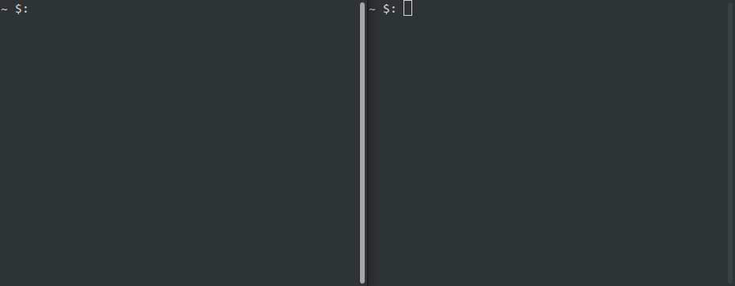

## minitalk

project of École 42 where it is necessary to make a communication program in the form of a client and a server using only signals SIGUSR1 and SIGUSR2. the project was made on linux.

the server is able to receive strings from multiple clients in a row also it works with unicode.

the project was made in accordance with the school design code standard in C language.



### how to use
the server must be started first, and then the client with the server pid.
```
make
./server
./client <pid_server> <message>
```
